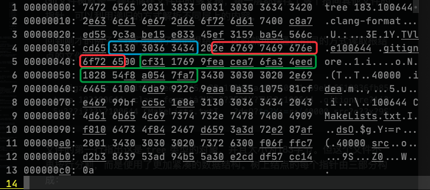
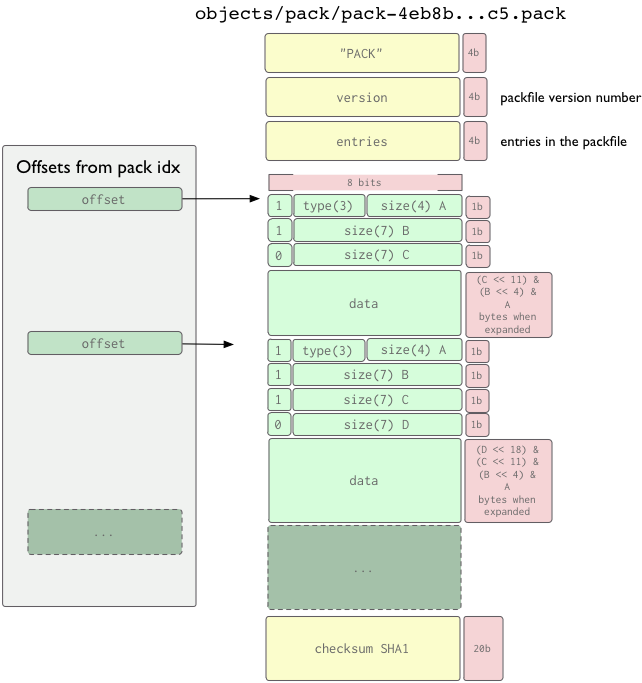

# QGit - Git快照浏览器

2020年春季学期《高级程序设计》第三次课程设计

计算机科学与技术系 171860508 张天昀

---

## 一、主要内容

本次试验的主要内容为一个基于Qt实现的图形界面Git记录浏览器，可浏览Git仓库中的提交记录以及某个记录的文件系统快照。程序仅依赖于Qt5和zlib库，实现了一下功能：

- 读取Git仓库索引列表
- 解析某个分支/索引下的提交列表
- 解析提交时的文件系统快照，并展示文件
- 支持Git 1.6以后的packfile格式，不支持Git-LFS

整个工程的代码目录结构如下：

```
QGit
├── CMakeLists.txt                            # CMake配置文件
├── LICENSE                                   # GPLv3
├── README.md                                 # 此说明文档
├── assets                                    # 文档使用的一些素材
├── dist                                      # 预编译的可执行文件
└── src                                       # 源代码目录
    ├── 3rdparty                              # 第三方代码
    │   └── IconFontCppHeaders                # 图标头文件
    │       ├── IconsFontAwesome5.h
    │       ├── IconsFontAwesome5Brands.h
    │       └── licence.txt
    ├── resources                             # 资源目录
    │   ├── 3rdparty
    │   │   └── Font-Awesome                  # 图标字体文件
    │   │       ├── fa-brands-400.ttf
    │   │       ├── fa-regular-400.ttf
    │   │       └── fa-solid-900.ttf
    │   └── resources.qrc                     # Qt资源文件
    ├── headers                               # 头文件目录
    │   ├── commit
    │   │   ├── detail.h
    │   │   ├── item.h
    │   │   └── list.h
    │   ├── constants.h                       # 全局常量
    │   ├── gitfs.h
    │   ├── reference
    │   │   ├── item.h
    │   │   └── list.h
    │   ├── repository.h
    │   ├── root.h
    │   ├── snapshot.h
    │   ├── tree
    │   │   ├── detail.h
    │   │   ├── item.h
    │   │   ├── list.h
    │   │   └── panel.h
    │   └── welcome.h
    ├── reference                             # Git索引
    │   ├── item.cpp                          # 单个索引类
    │   └── list.cpp                          # 索引列表类
    ├── commit                                # Git提交
    │   ├── detail.cpp                        # 提交详细信息类
    │   ├── item.cpp                          # 单个提交类
    │   └── list.cpp                          # 提交列表类
    ├── tree                                  # Git文件树
    │   ├── detail.cpp                        # 文件详细类
    │   ├── item.cpp                          # 单个结点类
    │   ├── list.cpp                          # 结点列表类
    │   └── panel.cpp                         # 文件树面板类
    ├── gitfs.cpp                             # Git文件系统类
    ├── main.cpp                              # 程序主入口
    ├── repository.cpp                        # Git仓库窗口类
    ├── root.cpp                              # 主窗口类
    ├── snapshot.cpp                          # Git快照窗口类
    └── welcome.cpp                           # 欢迎窗口类
```

## 二、Git文件系统简述

### 2.1 Git原理

Git在本质上就是一个文件快照系统。所有提交的文件通过zlib压缩后作为数据块，存储到一个将关键信息通过SHA-1算法运算得到的哈希值命名的文件当中去。

在提交的过程中，产生了三种基础类型的文件：

- 块文件（blob）：存储了文件压缩后的完整内容；
- 树文件（tree）：递归存储了一个目录中的所有文件的ID；
- 提交文件（commit）：存储了提交相关信息和树的根结点ID。

对于本项目而言，在Git目录中有两个不可或缺的文件夹：

- `refs`文件夹中记录了所有索引指向的提交ID；
- `objects`文件夹中记录了所有提交到系统中的文件。

因此，只要打开的仓库目录完整地保存有以上两个文件夹，就可以通过文件夹中的内容恢复出所有的提交数据和快照，甚至不需要安装Git。


### 2.2 索引解析

索引解析是非常简单的工作。`refs`中的文件保存了索引指向的提交ID，直接读取文件即可。例如我们读取此项目`master`分支的提交索引：

```shell
$ cat ./.git/refs/heads/master
8a6a802e5a10aa3d285d2adf966b66b994a66d10
```

此时我们就得到了`master`分支的最后一次提交ID。

### 2.3 提交解析

找到提交的ID后，就可以在`objects`文件夹中找到对应的提交文件。SHA-1运算得到的哈希共有40位，所有文件根据前两位哈希值存放在不同的文件夹中，每个文件的名称为后续38位哈希值。

例如，根据刚才找到的提交ID，我们打开`8a/6a802e5a10aa3d285d2adf966b66b994a66d10`文件并解压缩，查看其内容：

```shell
$ pigz -d < ./.git/objects/8a/6a802e5a10aa3d285d2adf966b66b994a66d10
commit 757tree f6e29c110b03a464a30931cb9ebb6618836fb85d
parent 4dd85d0d77034cedb4187fc22526bc496368f812
author Tianyun Zhang <doowzs@qq.com> 1590675630 +0800
committer Tianyun Zhang <doowzs@qq.com> 1590675630 +0800
gpgsig -----BEGIN PGP SIGNATURE-----
 
 iQEzBAABCAAdFiEEEPbmd4zAARFgDVTtEcwV8RJXUnQFAl7PyK4ACgkQEcwV8RJX
 UnRqOggAynb1XoEGUG5deoYvzus+ZkwaiD31WYeJSK2WbbknlpRe3mSGE7udb7sP
 tb0MOzjmb8NAzoPupj1xuNTjpXXtzWEYjV3T2ZxDm4Bw8oxWNA0LGibSwSC5lTv2
 nhoSlvEhgCj0E61wti2jMyvnvRCuSUCqMsvJX4EZrpIAdzbmXI2rdYKfhKuqzpgQ
 QSrVppQXUero+psxXW43nQ99oJLHQf3IDM3unkNhlGlZ7f41tvJsFLJzU2iDmKb4
 Ldlh3C+sSwjVKf/O0SPZNxq76IVzWpTtr8PXsdBd7Lhtnbt4PKj+cqBU38LGf4NQ
 Vm42WDSmIILxJo6v8UTG8bgkpphZ4g==
 =zvjJ
 -----END PGP SIGNATURE-----

reopen root window after closing a repository
```

提交文件的第一行（以`\0`字符结尾）指出了这个文件是`commit`类型的文件、大小757字节，接下来每行的内容都对应了不同的信息，从这个提交中可以提取的关键的内容为：

- 树的根结点是`f6e29c110b03a464a30931cb9ebb6618836fb85d`
- 此次提交只有`4dd85d0d77034cedb4187fc22526bc496368f812`一个父结点
- 提交作者是`Tianyun Zhang <doowzs@qq.com>`
- 提交时间是`1590675630 +0800`（UNIX时间戳）
- 提交的标题是`reopen root window after closing a repository`

通过宽度或深度优先搜索，我们可以找到整条提交树中的所有提交项目。

### 2.4 文件解析

Git文件树就是一颗存储在文件中的多叉树，每一层都保存了多个指向其他文件的指针，可以利用递归的方式解析不同层上的内容。

回到刚才的例子，我们找到了树的根结点，此时就可以通过相同的方式读取根结点的文件内容：

```shell
$ pigz -d < ./.git/objects/f6/e29c110b03a464a30931cb9ebb6618836fb85d
tree 183100644 .clang-formatȧ?U?:??3E?1Y?TVl?e100644 .gitignore?1i??Χo?N?(T??T?40000 .ideam??,??
5u???i???\?100644 CMakeLists.txtI	?dsO?$g?Y:=r⇯(40000 src?o??ҳ?9S???Z0???W?%    
```



文件的第一行指出这是`tree`类型的对象，并且大小为183字节。但这个文件不再按行分割，而是使用了更加紧凑的数据结构。树上结点的每个指针由三部分构成：

- `mode`（蓝色部分）：文件类型，Git中共有四种合法的文件类型：
  - `040000`：`tree`结点
  - `100644`：普通文件
  - `100755`：可执行文件
  - `120000`：符号链接
- `name`（红色部分）：一个空格后跟随字符串表示文件的名称，以`\0`为结尾。
- `hash`（绿色部分）：长度为40的哈希值，指向存储该对象的文件。

上面图片中的矩形区域即为一条记录，指向一个叫做`.gitignore`的普通文件，它的哈希值为`cf311769`。

获得文件的哈希之后，我们就可以以同样的方法获取在提交时快照的文件内容了。

```shell
$ pigz -d < .git/objects/cf/3117699feacea76fa34eed182854f8a0547fa7
blob 3356# Created by https://www.gitignore.io/api/qt,c++,code,macos,clion
# Edit at https://www.gitignore.io/?templates=qt,c++,code,macos,clion

### C++ ###
# Prerequisites
*.d
（后续内容省略）
```

### 2.5 packfile

当运行`git gc`指令，或者从远程仓库获取文件时，所有的文件会被打包，作为一个文件进行传输并存储，此时需要从打包后的文件中获取对应的数据。

索引文件会被存储到`packed-refs`文件中，一行一个哈希值与索引名称，此处不详细介绍了。

对象文件会被打包到packfile中，此处结合[GitBook](http://shafiul.github.io/gitbook/7_the_packfile.html)（GPLv3授权）的图片做一下简单说明：

存储对象的packfile共分为索引和数据两个文件，本项目仅实现了Git 1.6版本以后支持的packfile，即下图中右侧的索引文件版本。


- 文件头8字节存放魔数
- `fanout`：256个int类型的数组成的区域，表示对应开头的哈希值共有多少个（`fanout[0]`表示`00`，`fanout[1]`表示`01`……）
- `sha1`：每20个字节存储一个哈希值
- `crc`：每4个字节存储CRC校验码
- `offset`：每4个字节存储数据文件中对应的偏移量
- `64b_offset`：此部分与LFS有关，用于存储大于2GiB的文件，项目中没有实现
- 最后存放packfile的校验码

索引文件的存放方式决定了二分查找的读取方法：找到总项目数，然后在`sha1[0]`到`sha1[size]`之间进行二分查找所需要的哈希值，然后在`offset`数据表中直接读取出偏移量即可。



存放数据的packfile的格式为：

- 8字节的魔数、4字节表示对象数量
- 接下来每个对象采用变长方式存储：
  - 第一个字节存储类型和4比特长度值
  - 然后每个字节存储7比特长度值，直到最高位为`0`
  - 变长部分结束后存储文件内容

也就是说，读取packfile时，首先要根据在索引文件中的偏移量找到起始位置，然后读入第一字节判断对象类型，再读入变长的长度信息并计算长度，最后根据长度读入后续的数据。

### 2.6 OFS_DELTA与REF_DELTA对象

为了节省空间，在打包文件时会创建差分对象，由一个基础对象`base`和一系列差分指令`delta`组成。

- `OFS_DELTA`对象的`base`存放在同一个文件中，当前对象偏移量减去`offset`的位置；
- `REF_DELTA`对象的`base`为变长长度之后的20字节表示的哈希值对应的对象。

差分指令共有两种：

- 最高位为`1`为`copy`指令：从`base`中复制一部分到目标位置；
- 最高位为`0`为`insert`指令：从`delta`的后续中读取数据并插入到目标位置。

差分的文件形式较为复杂，且文档中几乎没有什么介绍，所以项目实现时参考了Git的源代码和一个Node写的Git客户端["node-git-core"](https://github.com/tarruda/node-git-core/blob/master/src/js/delta.js)的代码。


## 三、程序设计

### 3.1 类关系图

```
namespace QGit
      
                   Root
                  /    \
            Welcome    Repository -- GitFS
                      /          \
                content           Snapshot
               /       \         /        \
            Ref       Commit    Commit    Tree
            List      List      Detail    Panel

```


