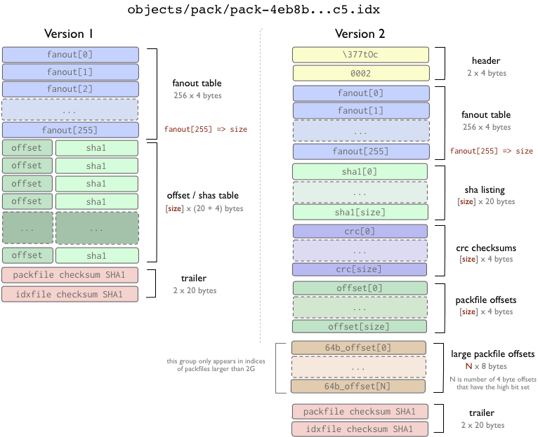
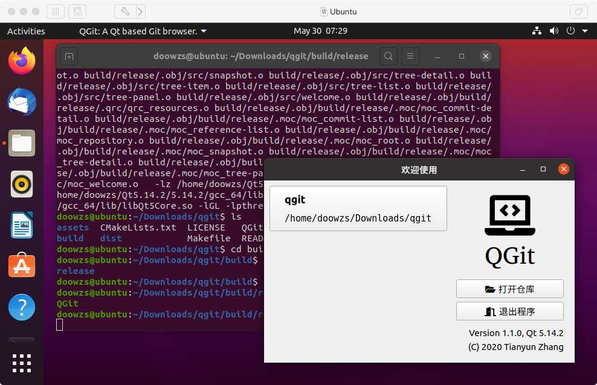
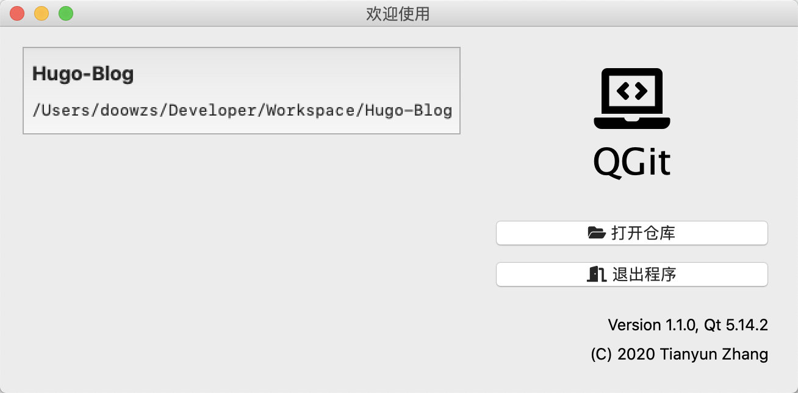
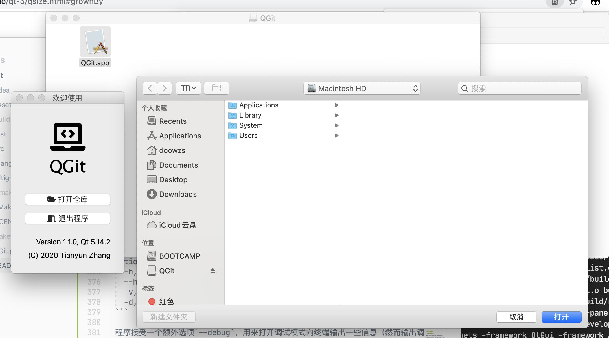
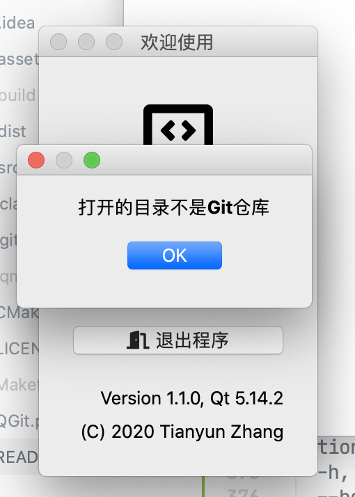
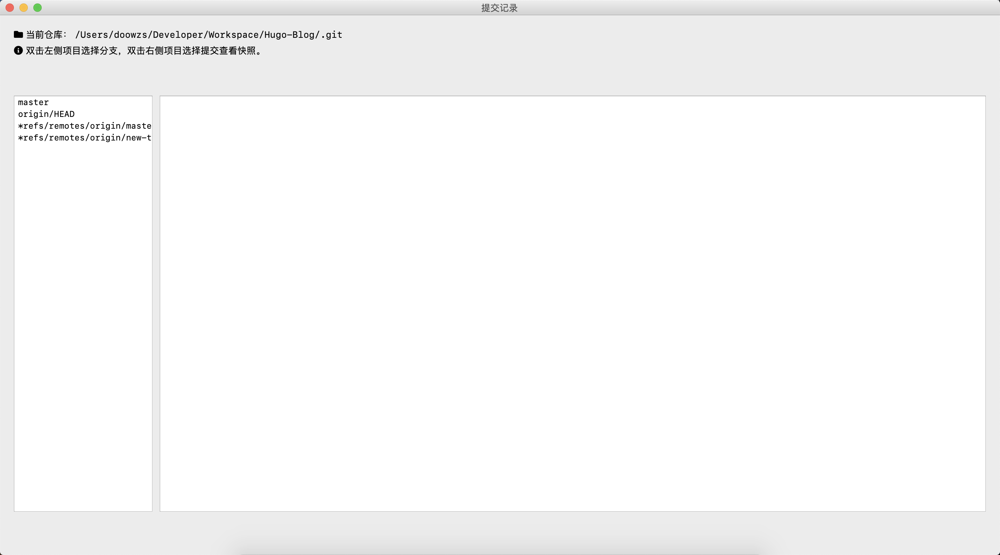
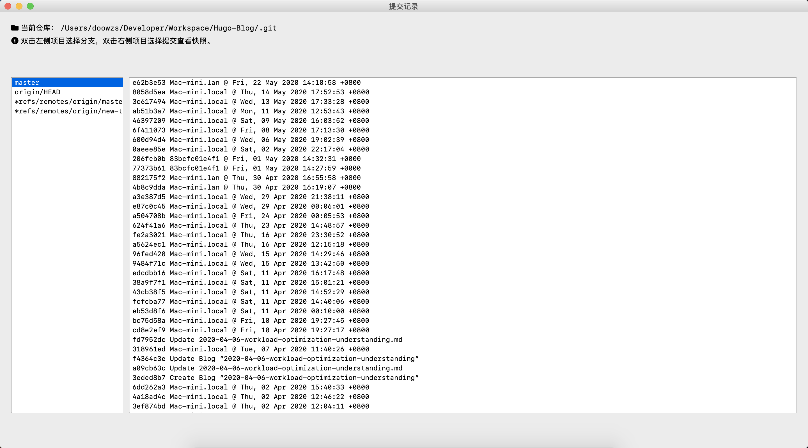
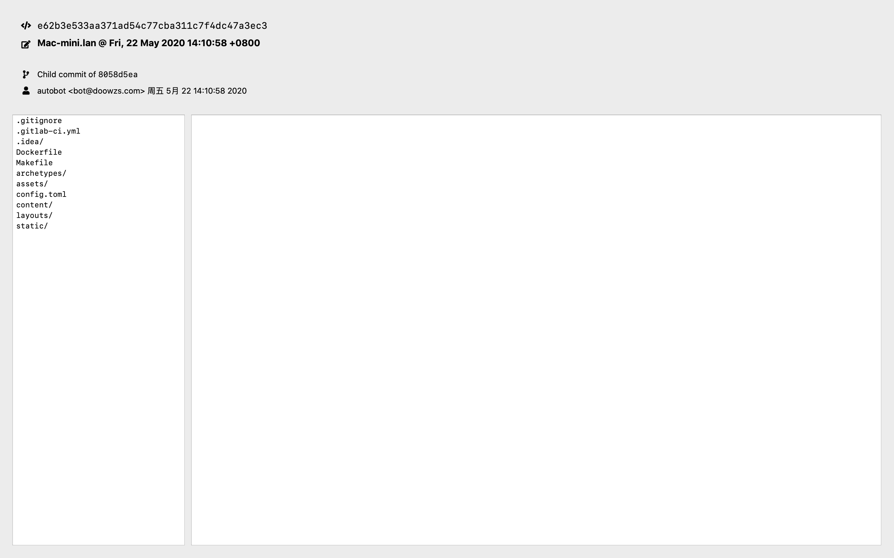
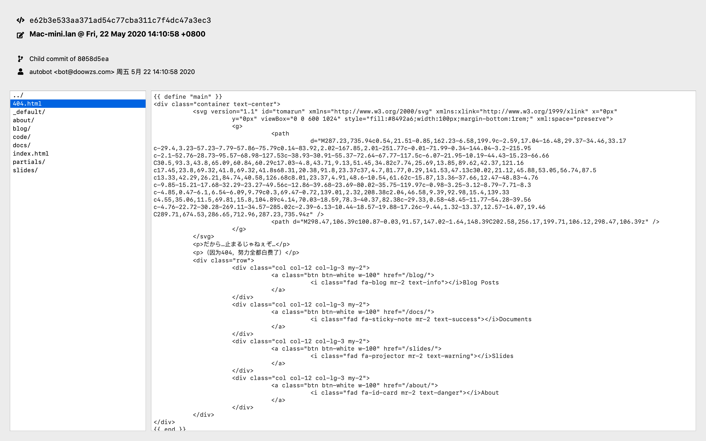
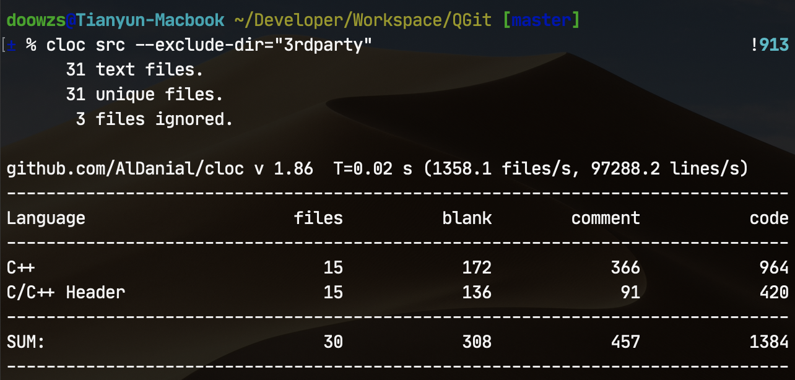

# QGit - Git快照浏览器

2020年春季学期《高级程序设计》第三次课程设计

计算机科学与技术系 171860508 张天昀

---

## 一、主要内容

本次试验的主要内容为一个基于Qt实现的图形界面Git记录浏览器，可浏览Git仓库中的提交记录以及某个记录的文件系统快照。程序仅依赖于Qt5和zlib库，实现了以下功能：

- 读取Git仓库索引列表
- 解析某个分支/索引下的提交列表
- 解析提交时的文件系统快照，并展示文件
- 支持Git 1.6以后的packfile格式，不支持Git-LFS

本次课程设计中使用的第三方代码：

- [Qt 5.14.2](https://www.qt.io/)
- [zlib 1.12.1](http://zlib.net/)
- [Font Awesome 5](https://fontawesome.com/)
- [IconFontCppHeaders](https://github.com/juliettef/IconFontCppHeaders)（GPLv3）

整个工程的代码目录结构如下：

```
QGit
├── CMakeLists.txt                            # CMake配置文件
├── LICENSE                                   # GPLv3
├── QGit.pro                                  # QMake配置文件
├── README.md                                 # 此说明文档
├── assets                                    # 文档使用的一些素材
├── dist                                      # 预编译的可执行文件
│   ├── QGit-1.1.0-darwin-amd64.dmg           # macOS App Bundle镜像文件
│   ├── QGit-1.1.0-linux-amd64.zip            # Linux二进制目录压缩包
│   └── QGit-1.1.0-windows-amd64.zip          # Windows二进制目录压缩包
└── src                                       # 源代码目录
    ├── 3rdparty                              # 第三方代码
    │   └── IconFontCppHeaders                # 图标头文件
    │       ├── IconsFontAwesome5.h
    │       ├── IconsFontAwesome5Brands.h
    │       └── licence.txt
    ├── resources                             # 资源目录
    │   ├── 3rdparty
    │   │   └── Font-Awesome                  # 图标字体文件
    │   │       ├── fa-brands-400.ttf
    │   │       ├── fa-regular-400.ttf
    │   │       └── fa-solid-900.ttf
    │   └── resources.qrc                     # Qt资源文件
    ├── headers                               # 头文件目录
    │   ├── commit-detail.h
    │   ├── commit-item.h
    │   ├── commit-list.h
    │   ├── constants.h                       # 全局常量
    │   ├── gitfs.h
    │   ├── reference-item.h
    │   ├── reference-list.h
    │   ├── repository.h
    │   ├── root.h
    │   ├── snapshot.h
    │   ├── tree-detail.h
    │   ├── tree-item.h
    │   ├── tree-list.h
    │   ├── tree-panel.h
    │   └── welcome.h
    ├── commit-detail.cpp                     # 提交详细信息类
    ├── commit-item.cpp                       # 单个提交类
    ├── commit-list.cpp                       # 提交列表类
    ├── gitfs.cpp                             # Git文件系统类
    ├── main.cpp                              # 程序主入口
    ├── reference-item.cpp                    # 单个索引类
    ├── reference-list.cpp                    # 索引列表类
    ├── repository.cpp                        # Git仓库窗口类
    ├── root.cpp                              # 主窗口类
    ├── snapshot.cpp                          # Git快照窗口类
    ├── tree-detail.cpp                       # 文件详细类
    ├── tree-item.cpp                         # 单个结点类
    ├── tree-list.cpp                         # 结点列表类
    ├── tree-panel.cpp                        # 文件树面板类
    └── welcome.cpp                           # 欢迎窗口类
```

## 二、Git文件系统简述

### 2.1 Git原理

Git在本质上就是一个文件快照系统。所有提交的文件通过zlib压缩后作为数据块，存储到一个将关键信息通过SHA-1算法运算得到的哈希值命名的文件当中去。

在提交的过程中，产生了三种基础类型的文件：

- 块文件（blob）：存储了文件压缩后的完整内容；
- 树文件（tree）：递归存储了一个目录中的所有文件的ID；
- 提交文件（commit）：存储了提交相关信息和树的根结点ID。

对于本项目而言，在Git目录中有两个不可或缺的文件夹：

- `refs`文件夹中记录了所有索引指向的提交ID；
- `objects`文件夹中记录了所有提交到系统中的文件。

因此，只要打开的仓库目录完整地保存有以上两个文件夹，就可以通过文件夹中的内容恢复出所有的提交数据和快照，甚至不需要安装Git。


### 2.2 索引解析

索引解析是非常简单的工作。`refs`中的文件保存了索引指向的提交ID，直接读取文件即可。例如我们读取此项目`master`分支的提交索引：

```shell
$ cat ./.git/refs/heads/master
8a6a802e5a10aa3d285d2adf966b66b994a66d10
```

此时我们就得到了`master`分支的最后一次提交ID。

### 2.3 提交解析

找到提交的ID后，就可以在`objects`文件夹中找到对应的提交文件。SHA-1运算得到的哈希共有40位，所有文件根据前两位哈希值存放在不同的文件夹中，每个文件的名称为后续38位哈希值。

例如，根据刚才找到的提交ID，我们打开`8a/6a802e5a10aa3d285d2adf966b66b994a66d10`文件并解压缩（此处用了命令行工具`pigz`），查看其内容：

```shell
$ pigz -d < ./.git/objects/8a/6a802e5a10aa3d285d2adf966b66b994a66d10
commit 757tree f6e29c110b03a464a30931cb9ebb6618836fb85d
parent 4dd85d0d77034cedb4187fc22526bc496368f812
author Tianyun Zhang <doowzs@qq.com> 1590675630 +0800
committer Tianyun Zhang <doowzs@qq.com> 1590675630 +0800
gpgsig -----BEGIN PGP SIGNATURE-----
 
 iQEzBAABCAAdFiEEEPbmd4zAARFgDVTtEcwV8RJXUnQFAl7PyK4ACgkQEcwV8RJX
 UnRqOggAynb1XoEGUG5deoYvzus+ZkwaiD31WYeJSK2WbbknlpRe3mSGE7udb7sP
 tb0MOzjmb8NAzoPupj1xuNTjpXXtzWEYjV3T2ZxDm4Bw8oxWNA0LGibSwSC5lTv2
 nhoSlvEhgCj0E61wti2jMyvnvRCuSUCqMsvJX4EZrpIAdzbmXI2rdYKfhKuqzpgQ
 QSrVppQXUero+psxXW43nQ99oJLHQf3IDM3unkNhlGlZ7f41tvJsFLJzU2iDmKb4
 Ldlh3C+sSwjVKf/O0SPZNxq76IVzWpTtr8PXsdBd7Lhtnbt4PKj+cqBU38LGf4NQ
 Vm42WDSmIILxJo6v8UTG8bgkpphZ4g==
 =zvjJ
 -----END PGP SIGNATURE-----

reopen root window after closing a repository
```

提交文件的第一行（以`\0`字符结尾）指出了这个文件是`commit`类型的文件、大小757字节，接下来每行的内容都对应了不同的信息，从这个提交中可以提取的关键的内容为：

- 树的根结点是`f6e29c110b03a464a30931cb9ebb6618836fb85d`
- 此次提交只有`4dd85d0d77034cedb4187fc22526bc496368f812`一个父结点
- 提交作者是`Tianyun Zhang <doowzs@qq.com>`
- 提交时间是`1590675630 +0800`（UNIX时间戳）
- 提交的标题是`reopen root window after closing a repository`

通过宽度或深度优先搜索，我们可以找到整条提交树中的所有提交项目。

### 2.4 文件解析

Git文件树就是一颗存储在文件中的多叉树，每一层都保存了多个指向其他文件的指针，可以利用递归的方式解析不同层上的内容。

回到刚才的例子，我们找到了树的根结点，此时就可以通过相同的方式读取根结点的文件内容：

```shell
$ pigz -d < ./.git/objects/f6/e29c110b03a464a30931cb9ebb6618836fb85d
tree 183100644 .clang-formatȧ?U?:??3E?1Y?TVl?e100644 .gitignore?1i??Χo?N?(T??T?40000 .ideam??,??
5u???i???\?100644 CMakeLists.txtI	?dsO?$g?Y:=r⇯(40000 src?o??ҳ?9S???Z0???W?%    
```


文件的第一行指出这是`tree`类型的对象，并且大小为183字节。但这个文件不再按行分割，而是使用了更加紧凑的数据结构。树上结点的每个指针由三部分构成：

- `mode`（蓝色部分）：文件类型，Git中共有四种合法的文件类型：
  - `040000`：`tree`结点
  - `100644`：普通文件
  - `100755`：可执行文件
  - `120000`：符号链接
- `name`（红色部分）：一个空格后跟随字符串表示文件的名称，以`\0`为结尾。
- `hash`（绿色部分）：长度为40的哈希值，指向存储该对象的文件。

上面图片中的矩形区域即为一条记录，指向一个叫做`.gitignore`的普通文件，它的哈希值为`cf311769`。

获得文件的哈希之后，我们就可以以同样的方法获取在提交时快照的文件内容了。

```shell
$ pigz -d < .git/objects/cf/3117699feacea76fa34eed182854f8a0547fa7
blob 3356# Created by https://www.gitignore.io/api/qt,c++,code,macos,clion
# Edit at https://www.gitignore.io/?templates=qt,c++,code,macos,clion

### C++ ###
# Prerequisites
*.d
（后续内容省略）
```

### 2.5 packfile

当运行`git gc`指令，或者从远程仓库获取文件时，所有的文件会被打包，作为一个文件进行传输并存储，此时需要从打包后的文件中获取对应的数据。

索引文件会被存储到`packed-refs`文件中，一行一个哈希值与索引名称，此处不详细介绍了。

对象文件会被打包到packfile中，此处结合[GitBook](http://shafiul.github.io/gitbook/7_the_packfile.html)（GPLv3授权）的图片做一下简单说明：

存储对象的packfile共分为索引和数据两个文件，本项目仅实现了Git 1.6版本以后支持的packfile，即下图中右侧的索引文件版本。



- 文件头8字节存放魔数
- `fanout`：256个int类型的数组成的区域，表示对应开头的哈希值共有多少个（`fanout[0]`表示`00`，`fanout[1]`表示`01`……）
- `sha1`：每20个字节存储一个哈希值
- `crc`：每4个字节存储CRC校验码
- `offset`：每4个字节存储数据文件中对应的偏移量
- `64b_offset`：此部分与LFS有关，用于存储大于2GiB的文件，项目中没有实现
- 最后存放packfile的校验码

索引文件的存放方式决定了二分查找的读取方法：找到总项目数，然后在`sha1[0]`到`sha1[size]`之间进行二分查找所需要的哈希值，然后在`offset`数据表中直接读取出偏移量即可。


存放数据的packfile的格式为：

- 8字节的魔数、4字节表示对象数量
- 接下来每个对象采用变长方式存储：
  - 第一个字节存储类型和4比特长度值
  - 然后每个字节存储7比特长度值，直到最高位为`0`
  - 变长部分结束后存储文件内容

也就是说，读取packfile时，首先要根据在索引文件中的偏移量找到起始位置，然后读入第一字节判断对象类型，再读入变长的长度信息并计算长度，最后根据长度读入后续的数据。

### 2.6 OFS_DELTA与REF_DELTA对象

为了节省空间，在打包文件时会创建差分对象，由一个基础对象`base`和一系列差分指令`delta`组成。

- `OFS_DELTA`对象的`base`存放在同一个文件中，当前对象偏移量减去`offset`的位置；
- `REF_DELTA`对象的`base`为变长长度之后的20字节表示的哈希值对应的对象。

差分指令共有两种：

- 最高位为`1`为`copy`指令：从`base`中复制一部分到目标位置；
- 最高位为`0`为`insert`指令：从`delta`的后续中读取数据并插入到目标位置。

差分的文件形式较为复杂，且文档中几乎没有什么介绍，所以项目实现时参考了Git的源代码和一个Node写的Git客户端["node-git-core"](https://github.com/tarruda/node-git-core/blob/master/src/js/delta.js)的代码。


## 三、程序设计

### 3.1 类关系图

```
namespace QGit
      
                   Root
                  /    \
            Welcome    Repository -- GitFS
                      /          \
                -----+-           Snapshot
               /       \         /        \
            Ref       Commit    Commit    Tree
            List      List      Detail    Panel

```

### 3.2 主窗口类`QGit::Root`

`QGit::Root`类继承了`QMainWindow`类，是程序的主窗口。在`main`函数中，程序会先加在资源文件中的字体，然后解析命令行参数（主要是初始化调试变量），之后创建一个主窗口对象，进入消息循环。

主窗口类创建后，如果已经在命令行中指定了目标目录，那么就会直接创建仓库窗口对象并读取Git仓库中的文件；否则则会创建一个欢迎窗口对象，并展示欢迎信息。

主窗口类有两个槽函数：

- `openRepository`与欢迎窗口类的`repositorySelected`信号绑定。当用户选择了一个Git仓库目录时，打开对应的仓库并创建仓库窗口对象。
- `closeRepository`与仓库窗口类的`repositoryClosed`信号绑定。当用户关闭了仓库窗口时，此函数被调用，删除仓库窗口对象并重新打开欢迎界面。

### 3.3 欢迎窗口类`QGit::Welcome`

欢迎窗口的界面仿造了Intellij IDEA等IDE的设计，主要分为两部分：

- 最近文件控件`recentWidget`
- 菜单控件`menuWidget`

创建欢迎窗口对象之前，主窗口类会读取存储在`recent.json`中保存的JSON格式的数据，其中保存了一个最近打开文件目录的字符串数组。主窗口类会把这个JSON数据转换为`QStringList`对象，并传入欢迎窗口的构造函数。在欢迎窗口中，如果最近打开的文件不为空，则会创建一个可滚动的列表`recentScrollArea`来展示这些数据。

窗口对象的另一部分则是固定的内容：图标、应用程序标题、两个按钮和应用程序信息。两个按钮分别负责打开仓库和退出程序，应用程序信息则是从静态类`QGit::Constants`获取信息并展示。

欢迎窗口类有两个槽函数：

- `selectRepository`与打开仓库的按钮相连。当按钮按下时，调用`QFileDialog`的静态方式展示一个选择文件的对话框，通过对话框来让用户打开Git仓库目录。当用户成功选择一个目录时，会释放`repositorySelected`信号。
- `closeApplication`与关闭程序的按钮相连。当按钮按下时，此槽函数会销毁主窗口。当Qt程序的所有窗口都不可见时程序会自动退出，由此实现了关闭程序的效果。

### 3.4 仓库窗口类`QGit::Repository`

仓库窗口类的界面设计分为三部分：

- 上方显示仓库目录和使用说明；
- 左侧为`QGit::Reference::List`对象，显示当前仓库的分支/索引列表；
- 右侧为`QGit::Commit::Item`对象，显示当前分支/索引中的提交列表。

当创建仓库窗口对象时，会首先创建一个`QGit::FS`文件系统类对象（具体见3.6节），作为文件读取解析的中间层使用（避免在对应的类中写繁琐的文件读写函数）。然后调用文件系统对象读取所有的分支/索引，创建成`QGit::Reference::Item`对象并添加到列表显示中。当用户双击某个索引对象时，会触发一个Lambda表达式构成的槽函数，进一步调用提交列表控件去加载所有的提交信息。

当提交列表的槽函数`loadCommits`被调用时，会先删除当前列表中已经加载的信息，然后使用宽度优先搜索（BFS）算法来加载所有的提交信息：

- 槽函数接受一个字符串类型的参数作为索引指向的提交ID；
- 算法有一个`QStringList`类型对象作为等待访问的提交“队列”，初始时只包含索引指向的提交；
- 每次从队列中取出一个提交ID
  - 调用文件系统类对象获取提交的内容并解析，创建一个`QGit::Commit::Item`类对象。
  - 然后将这个成员的父节点加入到队列中去（一般情况下一个commit只有一个parent，而首次的commit或孤儿节点没有parent，merge commit有多个parent）；
- 当未访问的提交列表为空时，BFS算法结束，将所有提交按照提交时间（`QDateTime`类数据成员）排序，添加到提交列表控件中去。

当用户双击某个提交对象时，会触发一个Lambda表达式构成的槽函数，释放`commitSelected`信号，显示仓库窗口并进一步调用快照窗口的`commitSelected`的槽函数，来读取并展示这个提交的详细信息。

仓库窗口类还重载了`QWidget`类的`closeEvent`函数，来捕获窗口关闭事件。当用户点击关闭窗口按钮时，这个重载函数会被调用并忽略窗口关闭事件，同时发出`repositoryClosed`信号，通知主窗口类销毁仓库窗口并重新打开欢迎界面。

### 3.5 快照窗口类`QGit::Snapshot`

快照窗口类的界面设计分为上下两部分：

- 上方为`QGit::Commit::Detail`对象，显示提交的详细信息，如哈希ID、标题、内容、提交作者和时间等；
- 下方为`QGit::Tree::Panel`对象：
  - 左侧为`QGit::Tree::List`对象，显示当前文件树结点的文件列表；
  - 右侧为`QGit::Tree::Detail`对象，显示当前打开文件的内容。

快照窗口使用了`QVector`作为栈，来实现文件管理器一般的浏览体验。

- 当栈为空时，代表用户当前在根目录处。
- 每当用户双击一个文件名称：
  - 如果该文件是子树，那么就把当前结点加入到栈中并调用`loadCurrentTree`方法加载该层的数据；
  - 如果该文件不是子树，那么就释放`objectSelected`信号，通知快照窗口类调用`Detail::loadBlobContent`方法，将文件内容加载到右侧的文本编辑框中。
- 当用户不在根目录时，列表首部有一个`../`项目，双击则从栈中弹出上一层目录并重新加载数据。

正如2.4节中所说，Git中除了tree以外有三种文件类型，此处仅仅展示`100644`类型即普通文件。当用户双击`100755`或`120000`类型文件项目时，将只显示该文件的类型而不展示内容。

### 3.6 文件系统类`QGit::FS`

本类主要实现第二节中所描述的Git文件系统读取和解析操作。`FS`类对外共有两个接口：

- `getObject`：返回`QByteArray`类型的原始数据；
- `getStream`：返回`QTextStream`类型的数据流。

在调用时，两个接口都只接受一个`hash`参数，表示需要读取的文件哈希名称；而两个函数返回的类型不同，适用于需要随机访问（原始数据）或顺序访问（数据流）不同的情况。

在内部实现中，共有以下成员函数：

- `readDataFromObjectFile`：从单个文件中读取数据；
- `readDataFromPackFiles`：从packfile中读取数据；
- `readOffsetFromPackIndexFile`：从索引文件中，用二分查找算法找到偏移量；
- `readDataFromPackDataFile`：根据偏移量，从数据文件中读取数据；
- `convertBytesToLength`：将变长的长度数据转换为数值；
- `inflateCompressedData`：将读取的数据用zlib解压缩；
- `patchDeltifiedData`：解析delta指令，恢复差分表示的数据。


## 四、程序运行

### 4.1 编译方式

本项目供配置了两个工具：CMake和QMake。

如果机器上安装了Qt，可以通过设置`Qt5_DIR`环境变量，然后用CMake进行编译。例如：

```shell
$ export | grep Qt5_DIR
Qt5_DIR=~/Developer/Qt/5.14.2/clang_64/lib/cmake/Qt5
$ mkdir build && cd build
$ cmake ../ && make
$ ./qgit
```

也可以将Qt的可执行文件目录加入到`PATH`环境变量中，然后用QMake进行编译。CMake配置中没有设置版本号，只有用QMake编译才会注入配置文件中的版本号。

```shell
$ export PATH=~/Developer/Qt/5.14.2/clang_64/bin:$PATH
$ qmake && make
$ cd ./build/release # 不同平台编译的目标文件执行方式不同
```

Release版本不会链接Qt的动态库，可以使用`windeployqt`、`macdeployqt`等工具将程序运行所需的文件复制到目标文件夹中来准备运行环境；Linux环境下我使用`cqtdeploy`打包程序。不同平台的运行方式如下：

- Windows：解压缩，然后运行`QGit.exe`；
- Linux：解压缩，然后运行`QGit.sh`；
- macOS：打开磁盘镜像文件，然后运行`QGit.app`。

下图为Ubuntu 20.04 LTS运行截图：



### 4.2 命令行参数

在命令行中运行程序时，可以用`--help`选项来打印帮助信息：

```shell
$ ./QGit --help
Usage: ./QGit [options]
QGit: A Qt based Git browser.

Options:
  -h, --help     Displays help on commandline options.
  --help-all     Displays help including Qt specific options.
  -v, --version  Displays version information.
  -d, --debug    Turn on debug mode
```

程序接受一个额外选项`--debug`，用来打开调试模式向终端输出一些信息（然而输出调试完之后都被删光了，所以基本没什么内容）。

### 4.3 主窗口/欢迎窗口

下面以macOS版本的程序为例展示程序的内容。当程序打开时首先展示欢迎页面，用户可以点击“打开仓库”按钮选择目录，或者点击“退出程序”按钮关闭程序。


如果用户此前已经打开过一些仓库，程序会读取相关记录并在左侧展示仓库目录列表：



当用户点击目录项目时即可打开对应的仓库。如果没有相关记录，点击“打开仓库”后即弹出对话框选择目录。此处用户可以选择仓库根目录，或者选择仓库中的`.git`文件夹，也可以选择bare仓库（通过`git clone --bare`获得）：



此时用户可以选择一个文件夹作为仓库目录打开。如果选择的文件夹不包含Git仓库对应的必须文件，则程序弹出对话框提示错误：



### 4.4 仓库窗口

用户成功打开一个仓库目录后，就会显示仓库窗口：



仓库窗口的左侧显示了Git仓库的分支/索引列表，右侧展示提交列表。一开始时提交列表为空，用户双击左侧的某个分支后，程序就会加载对应的提交内容并且展示在右侧。



### 4.5 快照窗口

当用户在仓库窗口中双击某个提交项目时，就会显示快照窗口：



快照窗口的上方显示了提交的详细信息，左侧为文件目录，右侧展示文件内容，一开始为空。用户可以双击左侧展示的文件项目来查看快照中文件的内容，并对其中的文本进行复制：


如果项目名称最后为`/`，则代表项目对应一个文件夹，用户可以双击进入该文件夹：



当用户不在快照的根目录时，文件列表顶部会出现`../`一项，用户双击即可返回到上一层目录中。


## 五、实验中遇到的问题和感想

### 5.1 遇到的问题与解决方案

- 多窗口之间的切换效果（按下按钮后关闭这个窗口再打开另一个等效果）

  解决方案：通过聚合实现多个子窗口和主窗口的关系，交给`QMainWindow`处理信号之后调整各个窗口的状态。同时保证Qt程序中至少有一个窗口可见，否则窗口全部隐藏则程序自动退出。

- 删除对象的时候出现运行错误

  解决方案：Qt中的对象（QWidget）等的生命周期是与`parent`绑定的，当`parent`消亡时，所有绑定的子对象都会被销毁。因此Qt程序中无需手动的去`delete`已经被绑定的对象，不会造成内存泄漏。同时为了防止销毁后处理信号时遇到异常，需要调用Qt的`deleteLater`函数来销毁对象而不是调用`delete`运算符。

- CMake编译出来的程序无法打包
  
  解决方案：虽然CMake搭配CLion用起来很爽，但是最后只好改用QMake编译并用Qt的打包工具打包程序（真香）。

- QMake不支持多个文件夹下的同名文件

  解决方案：经过搜索，这是Qt编译工具2018年就已经被反馈的bug（[QTBUG-70874](https://bugreports.qt.io/browse/QTBUG-70874)）：生成MOC文件没有遵守`object_parallel_to_source`选项的语义把文件放到不同的文件夹中。然而这个问题到现在还没有被修复，使用QMake的子项目方式过于繁琐，所以解决方案只有修改文件名这一种方式了。

### 5.2 实验感想/总结



通过灌入版权说明等一大堆没用的注释，注释代码比达到了惊人的33%！（战术后仰）

- 本次课程设计中`Item`、`List`等重复类名多次出现，利用了C++的`namespace`机制解决了相关问题，源代码放在不同文件夹中相当完美。无奈Qt的MOC处理程序过于弱智，努力全都白费了，只能乖乖地把目录扁平化，用不同的名称命名源代码文件。
- GUI程序开发过程中除了写程序需要适应消息处理（Qt中的信号/槽函数）的运行逻辑，还需要了解处理布局、样式的设计开发，综合起来难度很大。
- Qt提供的各种库STL兼容性好、支持跨平台，极大的简化了开发流程；但Qt的一堆宏定义、独特的编译工具也导致与传统C++程序、IDE、调试器兼容性不佳。
- Qt控件（如`QLabel`等）支持富文本，所以绘制控件样式可以用HTML代替，相对降低了一点的难度。
- Qt程序运行需要附带动态链接库，打包也是一大难点。感谢吕云哲同学帮我测试运行Windows和Linux程序、郑奘巍同学帮我测试运行macOS程序。
